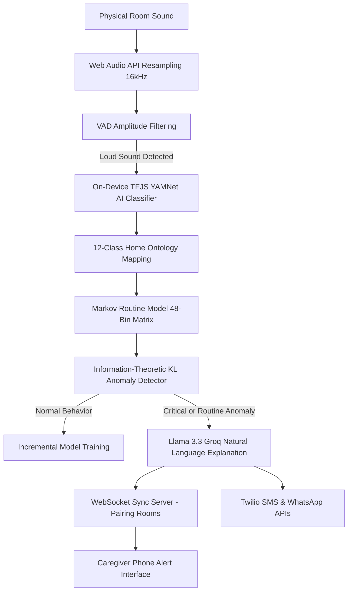

# 🛡️ Guardian — Local-First Ambient Audio Safety Monitor

Guardian is a privacy-preserving, local-first ambient sound monitor designed to support elderly individuals living alone. It captures and resamples ambient room sounds entirely on-device, running voice activity detection and TensorFlow.js sound classification locally to learn daily routines, detect behavioral anomalies (like unusual night activity or temporal silence), identify critical safety events (such as falls or distress calls), and sync alerts in real-time with remote caregivers.

---

## 🚀 Key Features

* **Edge-AI Sound Classification:** Runs the **YAMNet deep neural network** directly inside the browser using TensorFlow.js. Audio stays local and is never sent to the cloud.
* **Domestic Sound Ontology:** Maps YAMNet classifications into 12 specialized household classes: *footsteps shuffling, water washing, cooker whistle, mixie/grinder, gate/doorbell, devotional chants, afternoon nap silence, coughing, distress call, fall impact, vessel clatter, and phone ring.*
* **Voice Activity Detection (VAD):** Filters out noise floor signals using an RMS amplitude filter. Bypasses heavy tensor math during quiet intervals to save CPU cycles and battery.
* **Probabilistic Markov Routine Model:** Discretizes the 24-hour day into 48 bins (30-minute intervals) and builds a `[48, 12, 12]` transition matrix to learn the occupant's typical daily behavioral transitions (with Laplace smoothing to handle unseen events).
* **KL Divergence Anomaly Detection:** Calculates the information-theoretic Kullback-Leibler (KL) divergence score between observed event distributions and historical baselines, dynamically flagging behavioral anomalies.
* **Groq Llama 3.3 Alert Agent:** Conversational LLM API integrations (`llama-3.3-70b-versatile`) to translate raw mathematical anomalies into natural, non-alarmist descriptions, along with a step-by-step collapsible **Chain-of-Thought (CoT) reasoning accordion** explaining *why* the routine deviation is anomalous.
* **Twilio SMS & WhatsApp Alerts:** Real-time SMS and WhatsApp sandbox integrations that dispatch alerts directly to caregivers.
* **Room-Isolated WebSocket Sync:** Production Node.js Express server using `ws` WebSockets to synchronize active alerts and remote welfare check-ins across paired devices under isolated 6-character room codes.
* **Clinician Diagnostics PDF Report:** Custom CSS print layout that formats a clean 1-page health timeline of all logged safety alerts, expected baseline routines, and occupant verification ledgers.
* **Real-Time Privacy Verification Logger:** Displays outbound HTTP calls, proves that no binary audio wave data ever leaves the local device, and provides real-time response diagnostics (`⏳ Sending`, `✓ Success`, or `⚠️ Failed` with Twilio status codes).
* **One-Click Automated Demo Walkthrough:** Seeds the prior, logs typical activities, starts active monitoring, counts down 10 seconds, registers unexpected silence, and fires safety alerts to show the entire workflow end-to-end.

---

## 📁 System Architecture



---

## 🛠️ Installation & Setup

### Prerequisites
* **Node.js:** v18.0.0 or higher
* **npm:** v9.0.0 or higher

### Local Installation
1. Clone the repository:
   ```bash
   git clone https://github.com/SathvigaaBharathi/Guardian.git
   cd Guardian
   ```

2. Install dependencies:
   ```bash
   npm install
   ```

3. Create a `.env` file in the root directory and populate it with your API credentials:
   ```env
   # Groq Llama 3.3 Inference API Key
   VITE_GROQ_API_KEY=your_groq_api_key_here

   # Twilio API credentials (Optional)
   VITE_TWILIO_ACCOUNT_SID=your_twilio_sid_here
   VITE_TWILIO_AUTH_TOKEN=your_twilio_auth_token_here
   VITE_TWILIO_FROM_NUMBER=your_twilio_sms_number
   VITE_TWILIO_TO_NUMBER=your_recipient_sms_number

   # Twilio WhatsApp configuration (e.g. sandbox numbers)
   VITE_TWILIO_WHATSAPP_FROM=whatsapp:+14155238886
   VITE_TWILIO_WHATSAPP_TO=whatsapp:your_recipient_whatsapp_number
   ```

4. Run the local development server:
   ```bash
   npm run dev
   ```
   Open your browser and navigate to `http://localhost:5173/`.

---

## 🚀 Deployed Server Deployment

The project contains a production Express server (`server.js`) configured to serve the static built SPA and run the WebSocket synchronization channels on a unified port.

### Production Build & Launch
1. Build the frontend client:
   ```bash
   npm run build
   ```

2. Start the unified production server:
   ```bash
   npm start
   ```
   The production build runs on `http://localhost:10000/`.

### Deployment to Render / Heroku
* **Build Command:** `npm run build`
* **Start Command:** `npm start`
* **Environment Variables on Hosting Services:**
  Since the `.env` file is ignored by Git, you must enter your environment keys (`VITE_GROQ_API_KEY`, `VITE_TWILIO_ACCOUNT_SID`, etc.) directly inside the environment variables configurations panel of your hosting service dashboard.

---

## 📞 Twilio WhatsApp Sandbox Verification
If you are using Twilio's Free Sandbox for WhatsApp notifications:
1. Locate your Twilio Sandbox keyword (e.g. `join simple-observe` or `join details-shallow`) in the **Twilio Console** under *Messaging -> Try it out -> Send a WhatsApp message*.
2. Send this exact keyword from your personal WhatsApp account to the Twilio Sandbox WhatsApp number (**`+14155238886`**).
3. **Note:** Twilio Sandbox opt-in associations expire after **exactly 24 hours**. If WhatsApp alerts stop arriving, send the sandbox keyword message again to refresh the 24-hour session.

---

## 🔒 Privacy & Data Policy
Guardian is built to guarantee absolute privacy:
* All raw microphonic audio signals are resampled, filtered (VAD), and classified **locally on the device's CPU/GPU**.
* No audio recordings, waveform buffers, or raw audio data are ever transmitted to the internet.
* Outgoing integrations (Groq LLM text rendering and Twilio messaging APIs) only contain structured textual descriptors (e.g., event timing and mathematical anomaly categories). You can verify this in the real-time **Privacy Verification Logger** at the bottom of the dashboard page.
